

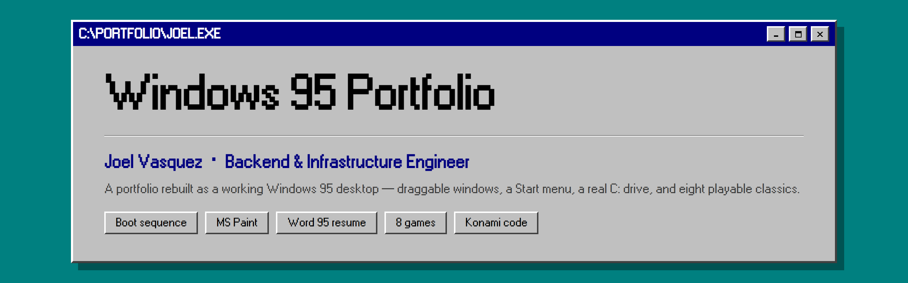

###

###

   

###

**A portfolio you don't scroll. You boot it.**

No hero section. No parallax. Just a teal desktop, a Start menu, and a resume that opens in Microsoft Word 95.

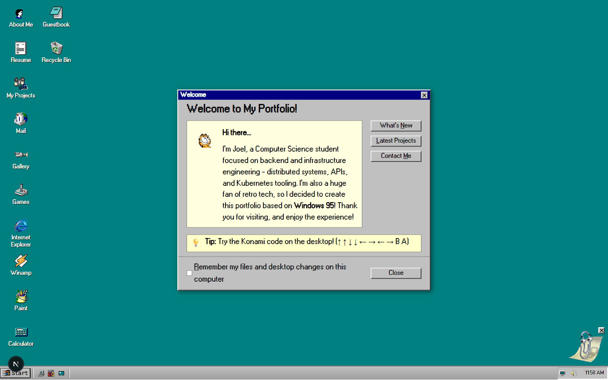

###

## The resume opens in Word 95

Not a PDF embed. A working Word 95 window: two toolbars, a ruler with indent markers, a status bar that tracks the caret, and an editable page sitting on the grey workspace. Change the font, resize the text, insert a table, run a spell check, zoom the page. Print it for real, or save it as Word, PDF or HTML.

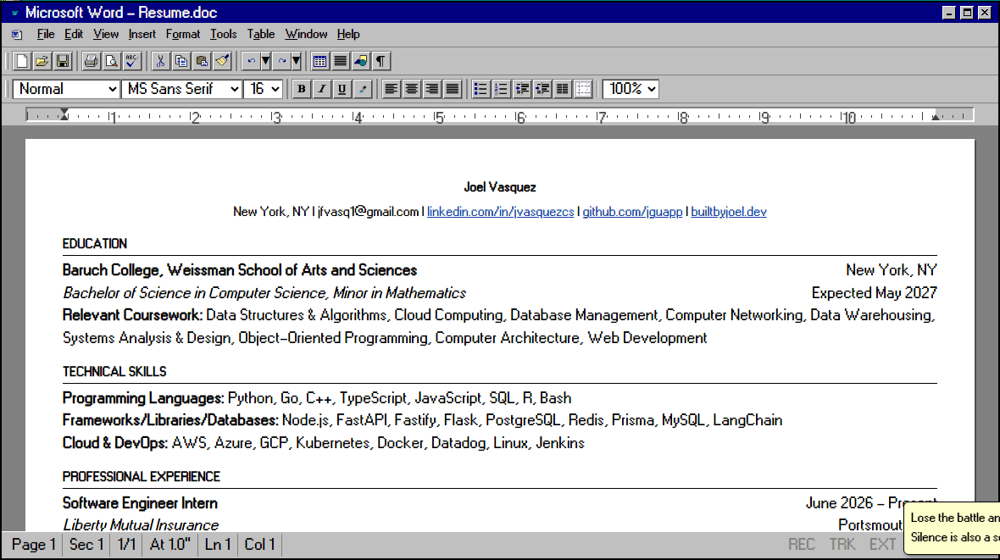

###

## Eight games, all playable

Solitaire, Minesweeper, FreeCell, Hearts and Reversi, the ones Windows actually shipped, plus Chess, Tetris and Pong. They live in a folder of program icons, the way they did.

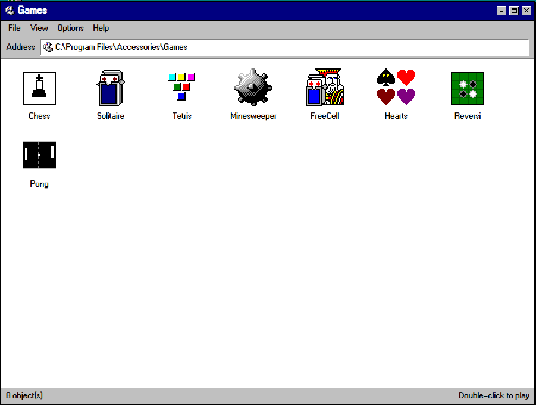

FreeCell knows its 32,000 deals by number, and they are the real ones: game 617 here is the 617 everyone remembers, including the -1 and -2 prank hands it hid. Solitaire pays Vegas at a dollar a card and still answers to the cheat it shipped with. Hearts asks your name, points the passing arrow and raises a moon when somebody shoots one. Minesweeper has the seven-segment counters, the smiley that reacts, a Custom Field dialog, best times that survive a refresh, and both of its 1995 cheats.

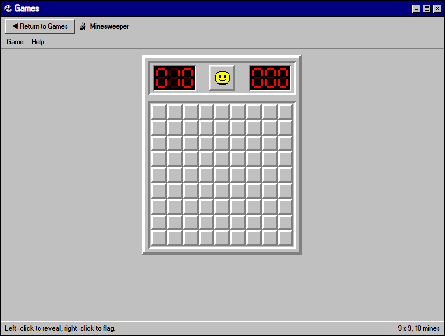

###

## MS Paint, rebuilt

Pencil, brush, eraser, fill, shapes, the colour palette along the bottom. Edit cuts, copies and pastes over a selection or the whole bitmap; Image flips, rotates, stretches and skews it; the text tool picks a face and size, and the airbrush has its three nozzles. Save to Desktop turns a drawing into a desktop icon that can outlive the visit, and Set As Wallpaper puts it behind everything.

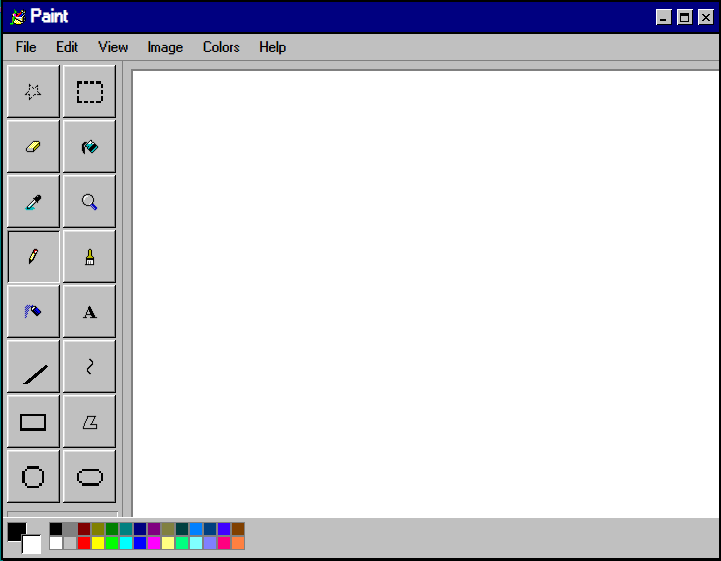

###

## The projects are a video site from 2005

Every project is a video page: view counts, star ratings, related videos down the side, and comment threads where people ask the awkward questions.

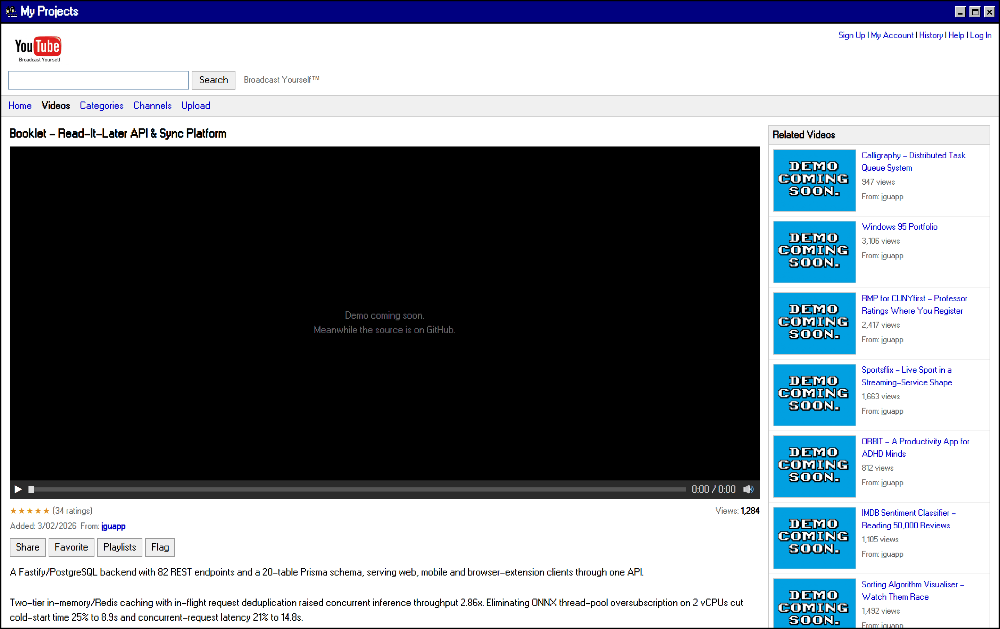

###

## Mail that behaves like mail

Contact is Outlook Express: folder tree, message list, reading pane, and a compose window that actually sends.

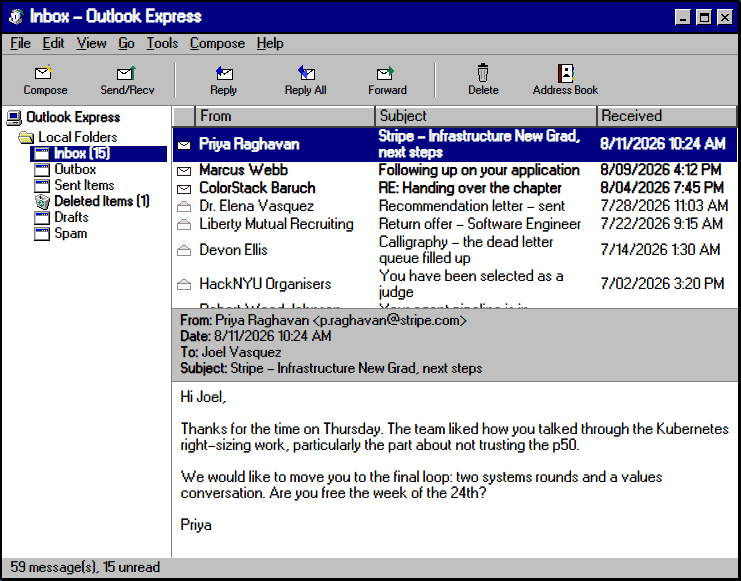

###

## A gallery, and a profile

The photos sit in `C:\My Pictures` as an Explorer folder in Thumbnail view, one subfolder per event.

<table align="center">
<tr>
<td width="50%">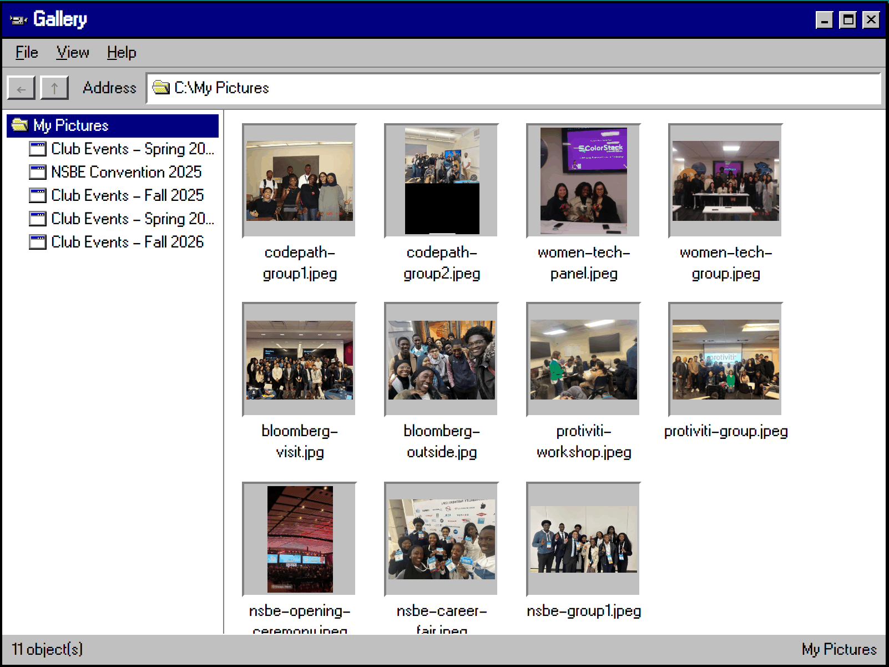</td>
<td width="50%">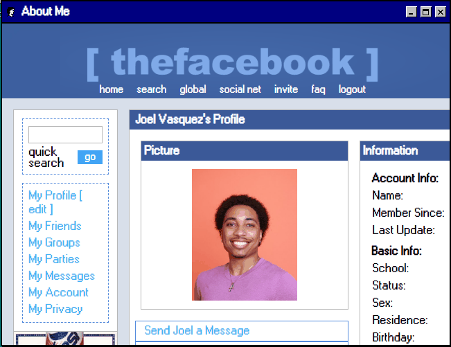</td>
</tr>
</table>

###

## And one thing that is not on the desktop at all

Type the Konami code anywhere: ↑ ↑ ↓ ↓ ← → ← → B A. Six creatures a side, a type chart, status moves, accuracy rolls that miss, a party screen and a real item bag, drawn in four shades on a 160x144 grid.

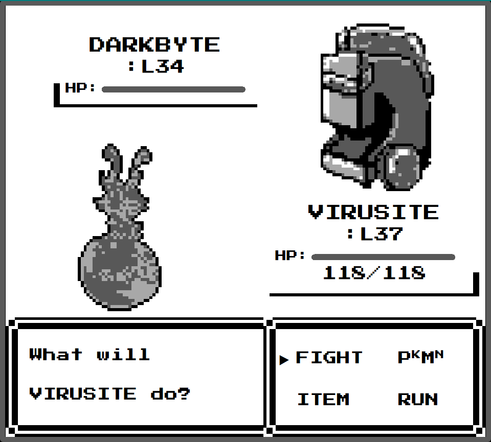

###

## Things worth finding

| | |
| --- | --- |
| **Winamp** | the real 2.9 skin engine, whipping the llama, with a synthesised opening track; the eject button takes your own MP3s |
| **Internet Explorer** | carries its own little internet, hit counter included |
| **Konami code** | ↑ ↑ ↓ ↓ ← → ← → B A, anywhere on the desktop, for a six on six battle with party menus, a real item bag, and back sprites |
| **Ctrl+Alt+R** | Run takes the real names: `calc`, `winmine`, `sol`, `mspaint`, `iexplore` |
| **Display Properties** | the wallpapers Windows 95 shipped, an upload of your own, Appearance schemes that recolour the whole shell, and resolutions from 640x480 up to 4K |
| **Clippy** | bottom right, contextual, dismissible for good |
| **Shut Down** | ends on the amber it's-now-safe screen; Restart reboots the machine |
| **Accessories** | nine programs, and CD Player, Phone Dialer, ScanDisk and Defrag are real ones |
| **MS-DOS Prompt** | twenty-five commands over a virtual `C:\` drive, `ADVENTURE.EXE` among them |
| **Notepad** | opens and saves to that same drive, and DOS can read what you wrote |
| **Blue Screen of Death** | it's in there, and it's faithful |
| **Drag to the Recycle Bin** | and File > Restore puts it back where it was |
| **The clock** | click it for Date/Time Properties, ticking analogue face and all |
| **Release Notes** | Start > Documents, the whole history of the desktop in the desktop |
| **Right-click** | the desktop, the icons, the Solitaire table, everywhere |
| **The welcome checkbox** | opt in, and your files, drawings and desktop icons survive between visits |
| **Alt+Q** | the window switcher; Tab, arrows and Enter drive the desktop |
| **Find** | Start > Find genuinely searches the virtual drive, file contents included |
| **QuickRes** | the little monitor in the tray pops a resolution menu, as the PowerToy did |
| **ADVENTURE.EXE** | type it at the DOS prompt: fourteen rooms, a two-word parser, and a night shift that ends with Windows 95 shipping |
| **F1** | opens help for whichever program is focused, WinHelp green text and all |
| **The tray speaker** | double-click it for the four-fader Volume Control |
| **Start > Documents** | lists the documents you have actually opened, and one you should not |
| **Chess** | drop MP3s into `public/sounds/chess/` and it plays your own move sounds |
| **Add/Remove Programs** | in Control Panel, listing this desktop as installed software, and refusing to uninstall any of it |

###

## Built with

   

###

<h3>Hire me, or just come play with the Start menu.</h3>

© Joel Vasquez · MIT Licensed

